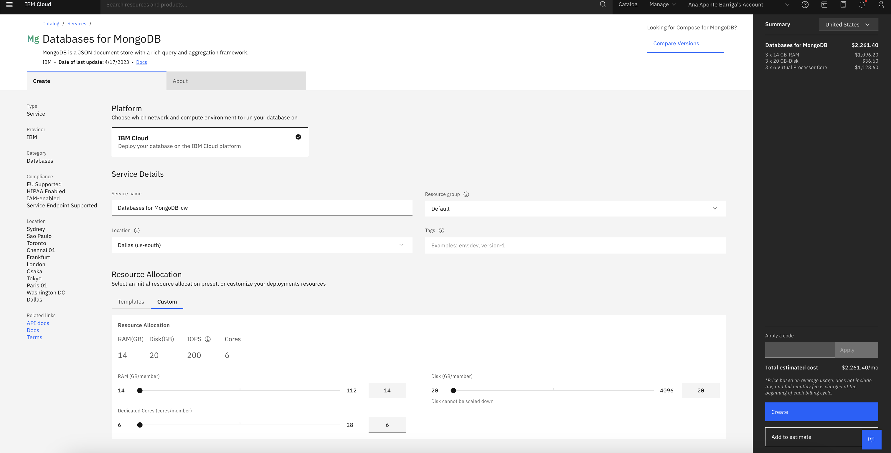
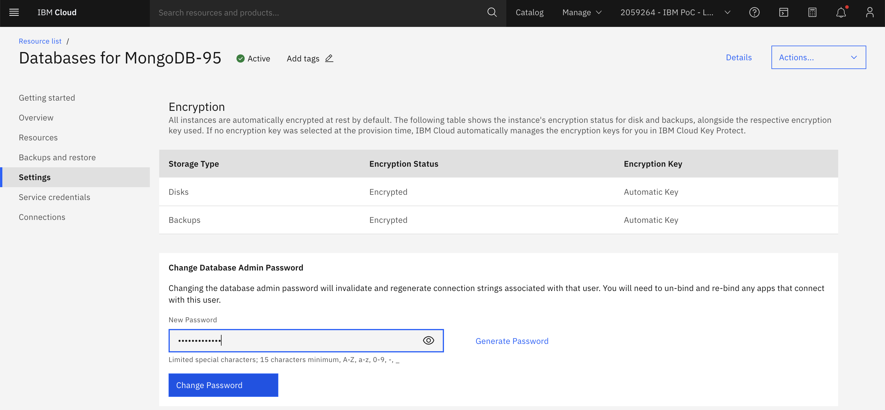
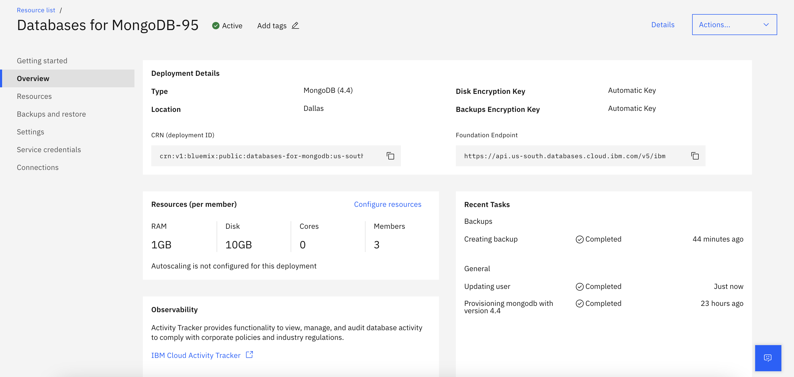
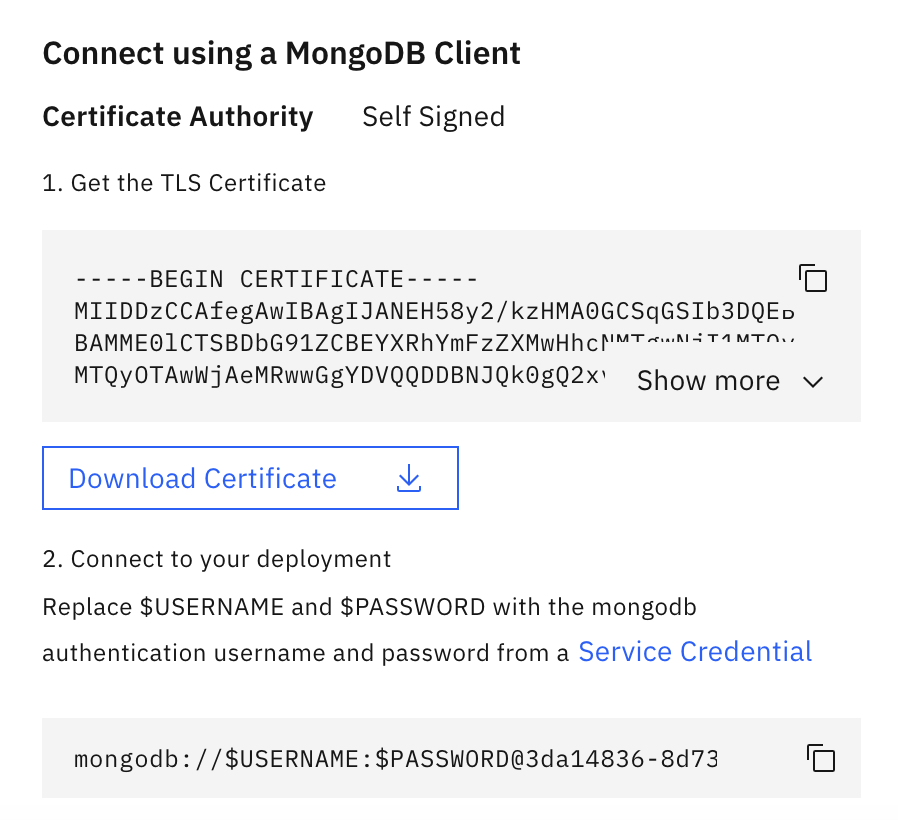
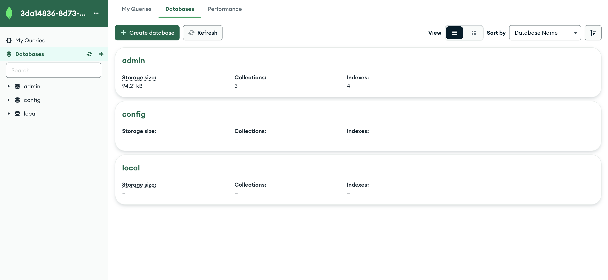

# IBM-Cloud-MongoDB-Acceso

En esta guía se presenta un paso a paso para crear y acceder a una instancia de Databases for MongoDB en IBM Cloud.


## Contenido
1. [Pre-Requisitos](#pre-requisitos-pencil)
2. [Creación de una instancia de Databases for MongoDB](#creación-de-una-instancia-de-databases-for-mongodb-cloud)
3. [Conexión a MongoDB por medio del cliente MongoDB Compass](#conexión-a-mongodb-por-medio-del-cliente-mongodb-compass-leaves)
4. [Autores](#autores-black_nib)

## Pre-Requisitos :pencil:
- Contar con una cuenta en [IBM Cloud](cloud.ibm.com)
- [MongoDB Compass](https://www.mongodb.com/try/download/compass)

## Creación de una instancia de Databases for MongoDB :cloud:

1. Ingrese a su cuenta en [IBM Cloud](cloud.ibm.com), en el catálogo seleccione el servicio [Databases for MongoDB](https://cloud.ibm.com/databases/databases-for-mongodb/create?catalog_query=aHR0cHM6Ly9jbG91ZC5pYm0uY29tL2NhdGFsb2c%2FY2F0ZWdvcnk9ZGF0YWJhc2Vz)

2. Asigne un nombre a su instancia, un grupo de recursos y una ubicación. Para la selección de los recursos de la instancia, puede seleccionar una de las opciones presentadas o dar click en la pestaña **Custom** para definir tamaños personalizados.

 

Dé click en **Create**. El aprovisionamiento de su instancia demorará al rededor de 30 minutos.

3. Luego de que se complete el despliegue de su instancia, ingrese a la sección **Settings** que encuentra en el menú de la izquierda. Acá podrá digitar la contraseña de acceso que desee asignar a su instancia, luego de esto dé click en **Change Password**. Le aparecerá un anuncio de cambio de contraseña, dé click en aceptar.

 

4. Ingrese a la sección **Overview** disponible en el menú de la izquierda.

 

Posteriormente, desplácese a la parte inferior de la pantalla, sección **Endpoints**. Acá encontrará una sección llamada **Connect using a MongoDB Client**. Descargue el certificado TLS y copie la URI de acceso.



## Conexión a MongoDB por medio del cliente MongoDB Compass :leaves:

1. Acceda a MongoDB Compass, le aparecerá por defecto la pantalla de creación de una nueva conexión.

 

2. En el cuadro de texto ingrese la URI de su instancia de MongoDB, la cual copió en el paso 4 de la sección anterior.

 

3. Dé click en **Advanced connection options**, y posteriormente en **Authentication**. Acá deberá ingresar el usuario y contraseña asignados a su instancia. 

El usuario por defecto es ```admin```

 

4. Dé click en la pestaña **Advanced** y verifique que el nombre del Replica Set sea ```replset```

 

5. Dé click en la pestaña **TLS/SSL** y seleccione **On** para la conexión TLS. Dé click en **Select a file** en la sección **Certificate Authority (.pem)**, acá agregue el certificado que descargó de su instancia en IBM Cloud.

 

6. Dé click en **Connect**, de esta forma ya tendrá acceso a su instancia de Databases for MongoDB desde el cliente instalado en su equipo.

 

## Autores :black_nib:
Equipo IBM Cloud Tech Sales Colombia