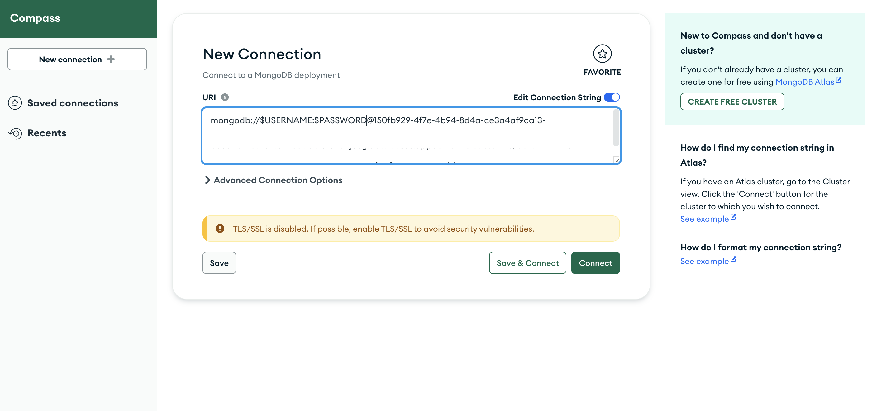

# IBM-Cloud-MongoDB-Acceso

En esta guía se presenta un paso a paso para crear y acceder a una instancia de Databases for MongoDB en IBM Cloud.


## Contenido
1. [Pre-Requisitos](#pre-requisitos-pencil)
2. [Creación de una instancia de Databases for MongoDB](#creación-de-una-instancia-de-databases-for-mongodb-cloud)
3. [Conexión a MongoDB por medio del cliente MongoDB Compass](#conexión-a-mongodb-por-medio-del-cliente-mongodb-compass-leaves)
4. [Autores](#autores-black_nib)

## Pre-Requisitos :pencil:
- Contar con una cuenta en [IBM Cloud](cloud.ibm.com)
- [MongoDB Compass](https://www.mongodb.com/try/download/compass)

## Creación de una instancia de Databases for MongoDB :cloud:


## Conexión a MongoDB por medio del cliente MongoDB Compass :leaves:

1. Acceda a MongoDB Compass, le aparecerá por defecto la pantalla de creación de una nueva conexión.

 

2. En el cuadro de texto ingrese la URI de su instancia de MongoDB

 

3. Dé click en **Advanced connection options**, y posteriormente en **Authentication**. Acá deberá ingresar el usuario y contraseña asignados a su instancia. 

El usuario por defecto es ```admin```

 

4. Dé click en la pestaña **Advanced** y verifique que el nombre del Replica Set sea ```replset```

 

5. Dé click en la pestaña **TLS/SSL** y seleccione **On** para la conexión TLS. Dé click en **Select a file** en la sección **Certificate Authority (.pem)**, acá agregue el certificado que descargó de su instancia en IBM Cloud.

 

6. Dé click en **Connect**, de esta forma ya tendrá acceso a su instancia de Databases for MongoDB desde el cliente instalado en su equipo.

## Autores :black_nib:
Equipo IBM Cloud Tech Sales Colombia